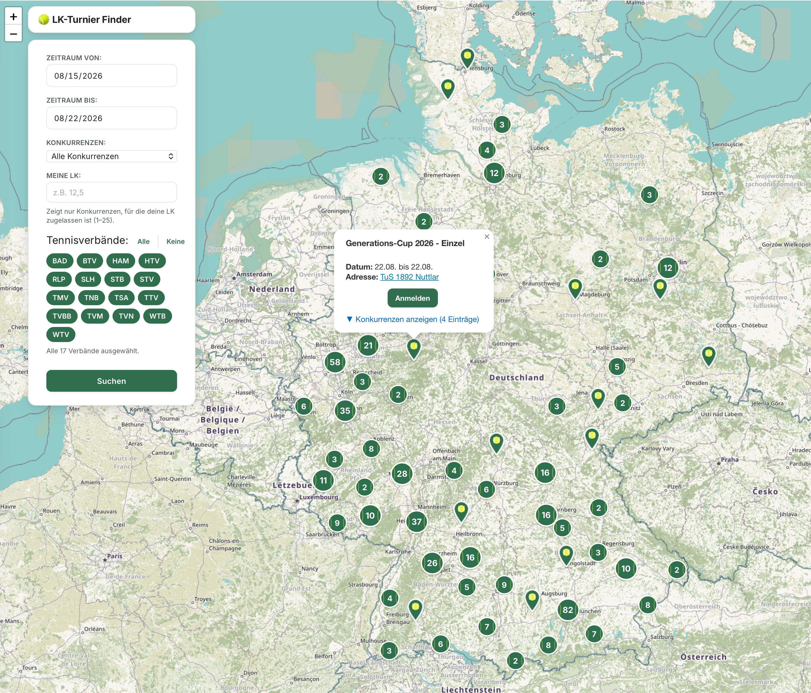
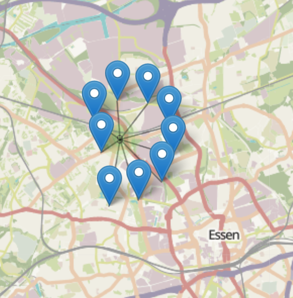

<h1 align="center" style="border-bottom: none;">🎾 Tennis Tournament Finder</h1>
<h3 align="center">A simple Map showing all recent tennis tournaments for passionate tennis players in Germany.</h3>
<p align="center">
    <a href="https://github.com/timoknapp/tennis-tournament-finder/actions/workflows/backend.yml">
        
    </a>
    <a href="https://github.com/timoknapp/tennis-tournament-finder/actions/workflows/pages/pages-build-deployment">
        
    </a>
</p>


## Getting Started

[Try it out!](https://timoknapp.github.io/tennis-tournament-finder/)

## Features

* Currently supported tennis federations:
  * [Badischer Tennis Verband (BAD)](https://www.badischertennisverband.de/)
  * [Hamburger Tennisverband (HAM)](https://www.hamburger-tennisverband.de)
  * [Hessischer Tennis Verband (HTV)](https://www.htv-tennis.de/)
  * [Rheinland-Pfälzischer Tennis Verband (RPTV)](https://www.rlp-tennis.de/)
  * [Saarländischer Tennisbund (STB)](https://www.stb-tennis.de)
  * [Sächsischer Tennis Verband (STV)](https://www.stv-tennis.de)
  * [Tennisverband Mecklenburg-Vorpommern (TMV)](https://www.tennis-mv.de)
  * [Tennisverband Niedersachsen-Bremen (TNB)](https://www.tnb-tennis.de)
  * [Tennisverband Sachsen-Anhalt (TSA)](https://www.tennis-tsa.de)
  * [Thüringer Tennis-Verband (TTV)](https://www.ttv-tennis.de)
  * [Tennis-Verband Berlin-Brandenburg (TVBB)](https://www.tvbb.de)
  * [Tennisverband Mittelrhein (TVM)](https://www.tvm-tennis.de)
  * [Tennis-Verband Niederrhein (TVN)](https://www.tvn-tennis.de)
  * [Württembergischer Tennis Bund (WTB)](https://www.wtb-tennis.de/)
  * [Westfälischer Tennis-Verband (WTV)](https://www.wtv.de)
* Helps you finding the tournaments around you
* Lets you filter tournaments by date, competition type, and federation
* Short link to the official Tournament at [tennis.de](https://spieler.tennis.de/web/guest/turniersuche) in order to sign up for the tournament
* Link to address on Google Maps.
* PWAs (Progressive Web Apps) support. You can install the app on your phone.

### Soon

* Support for more tennis federations:
  * [Bayerischer Tennis Verband (BTV)](https://www.btv.de) — no longer served by
    liga.nu, so it needs its own parser
  * [Tennisverband Schleswig-Holstein (TSH)](https://www.tennis.sh)
* Store favorite tournaments (locally)

## Backend Development

### Running the Backend Server

The backend is written in Go and provides the API for fetching tournament data from various tennis federations.

```bash
cd backend
go run ./cmd/main.go
```

### Running the Tests

Every external dependency (federation websites and the Nominatim geocoding
service) is mocked with local `httptest` servers, so the suite runs offline and
deterministically.

```bash
cd backend

# Full suite with the race detector (requires a C compiler for -race)
go test -race ./...

# Quick run without the race detector
go test ./...

# With coverage
go test -coverprofile=coverage.out ./...
go tool cover -func=coverage.out
```

HTML fixtures for the federation parsers live in
`backend/pkg/tournament/testdata/`. When a federation changes its markup, update
the corresponding fixture and adjust the expectations in
`backend/pkg/tournament/tournament_test.go` in the same commit.

By default the tests log at `ERROR` level. Set `TTF_LOG_LEVEL=DEBUG` to see the
full output while debugging a failure.

### Configuration

| Environment variable | Default | Description |
| --- | --- | --- |
| `TTF_LOG_LEVEL` | `INFO` | Log verbosity: `DEBUG`, `INFO`, `WARN`, `ERROR`. |
| `TTF_CACHE_PATH` | `./data/cache.bolt` | BoltDB file backing the geocoding cache. |
| `TTF_CACHE_MEMORY` | `true` | Keep an in-memory copy of the cache. |
| `TTF_HTTP_TIMEOUT_SECONDS` | `20` | Total timeout for federation requests. |
| `TTF_GEOCODING_TIMEOUT_SECONDS` | `20` | Total timeout for geocoding requests. |
| `TTF_USER_AGENT` | `TennisTournamentFinder/1.0 (+repo URL)` | `User-Agent` sent upstream. Forks should set their own contact details. |
| `TTF_NOMINATIM_URL` | `https://nominatim.openstreetmap.org/search.php` | Geocoding endpoint. Point this at a self-hosted Nominatim instance if you need higher throughput. |
| `TTF_NOMINATIM_INTERVAL_MS` | `1000` | Minimum spacing between uncached geocoding requests. Do not lower this for the shared public instance. |
| `TTF_CLUB_LOCATIONS` | *(embedded file)* | Path to a custom club location override file. |
| `TTF_RESULT_CACHE` | `true` | Set to `false` to bypass the tournament result cache. |
| `TTF_RESULT_CACHE_PATH` | `./data/results.bolt` | BoltDB file backing the result cache. |
| `TTF_CACHE_TTL_MINUTES` | `120` | How long cached tournament results stay fresh. |
| `TTF_CACHE_STALE_MINUTES` | `1440` | How long expired results may still be served when a federation is unreachable. |
| `TTF_SCHEDULER_WARMUP_DAYS` | `30` | How far ahead the scheduled run pre-fetches. |

#### External service usage

The public Nominatim instance requires an identifying `User-Agent` and permits
at most one request per second. The backend enforces both: requests carry the
agent above and are serialized process-wide by a rate limiter. Cached lookups
never reach the network, so they do not consume that budget. See the
[Nominatim usage policy](https://operations.osmfoundation.org/policies/nominatim/)
before raising the request rate.

### Result caching

Tournament results are cached per federation and query, so a user request
normally performs no scraping at all.

* **Keyed** by federation, date range and competition type, so one slow
  federation never holds up the others and a refresh only redoes expired work.
* **Persistent** (BoltDB), so a restart keeps whatever the scheduler fetched.
* **Stale-tolerant**: when a federation is unreachable, the expired copy is
  still served (up to `TTF_CACHE_STALE_MINUTES`) and marked as stale, because
  an out-of-date list is far more useful than an empty map.
* **Stampede-safe**: concurrent misses for the same key trigger a single
  upstream fetch.

Cache contents are visible at `http://127.0.0.1:9090/stats` under
`result_cache`, including how many entries are fresh, stale or expired.

Enable the scheduler to keep the cache warm ahead of user traffic; it
invalidates before fetching, so a scheduled run always retrieves current data.

### API response format

By default the API returns a bare JSON array of tournaments, which is what
older clients expect.

Pass `?format=full` for per-federation status, so a client can tell "no
tournaments match" apart from "this federation is down":

```json
{
  "tournaments": [ ... ],
  "federations": [
    { "id": "BAD", "name": "Badischer Tennisverband", "status": "ok", "count": 141 },
    { "id": "WTV", "name": "Westfälischer Tennis-Verband", "status": "stale", "count": 131, "age_seconds": 7200 }
  ],
  "partial": true
}
```

`status` is one of `ok`, `cached`, `stale` or `error`. `partial` is true when
any federation failed or is serving stale data; the frontend surfaces that as a
banner instead of silently showing fewer tournaments.

### Geocoding and map pins

Federations publish only a club name, never a postal address, so the venue's
city has to be derived from that name. Resolution happens in this order:

1. **Curated overrides** — `backend/pkg/clublocations/data/club-locations.json`
2. **Name heuristics** — `backend/pkg/placename`
3. **Federation default coordinates** — last resort; several tournaments then
   share one marker

#### Fixing a wrong map pin

If a tournament shows up in the wrong place, add an entry to
`backend/pkg/clublocations/data/club-locations.json`. No code change is needed:

```json
{
  "contains": "Lohausener",
  "city": "Düsseldorf",
  "state": "Nordrhein-Westfalen",
  "note": "Lohausen is a district of Düsseldorf; not derivable from the name."
}
```

* Use `match` for an exact club name or `contains` for a substring.
* Matching ignores case, punctuation, umlaut spelling and extra spaces.
* Prefer `city` (it gets geocoded). Use `lat`/`lon` only when even the city is
  ambiguous.
* Exact matches beat `contains`; among `contains` entries the longest wins.
* `note` is required by the tests — explain why the automatic extraction fails.

A different file can be supplied with `TTF_CLUB_LOCATIONS`.

#### Measuring accuracy

`cmd/geobench` resolves a benchmark set of real club names against a live
Nominatim instance and reports the hit rate. It performs rate-limited network
requests, so it is a manual tool and is never run by CI:

```bash
cd backend
go run ./cmd/geobench      # add -v for coordinates and matched place names
```

### Log Level Configuration

The backend supports configurable log levels via the `TTF_LOG_LEVEL` environment variable:

**Available Log Levels:**

* `DEBUG` - Detailed debugging information (shows all logs)
* `INFO` - General information messages (default, recommended for production)
* `WARN` - Warning messages only
* `ERROR` - Error messages only

**Usage Examples:**

```bash
# Debug mode (shows everything)
TTF_LOG_LEVEL=DEBUG go run ./cmd/main.go

# Production mode (default)
TTF_LOG_LEVEL=INFO go run ./cmd/main.go

# Minimal logging (errors only)
TTF_LOG_LEVEL=ERROR go run ./cmd/main.go

# Set persistently in your shell
export TTF_LOG_LEVEL=DEBUG
go run ./cmd/main.go
```

**Log Output Format:**

```text
[2025-08-06T14:23:45.123Z] INFO: Starting Tennis Tournament Finder backend server...
[2025-08-06T14:23:45.124Z] DEBUG: Cache HIT (location): location_key for tournament 12345
[2025-08-06T14:23:45.125Z] INFO: Get Tournaments from: 03.08.2025 to: 10.08.2025
```

All timestamps are in UTC for consistency across time zones.

### Scheduler

Enable the in-process scheduler purely via env vars (no admin endpoint required):

```bash
export TTF_SCHEDULER_ENABLED=true
export TTF_SCHEDULER_CRON="0 2 * * *"         # default: 02:00 daily
export TTF_SCHEDULER_COMP_TYPE=""              # optional
export TTF_SCHEDULER_FEDERATIONS=""            # optional
```

For more details, see docs/scheduler.md.

## FAQ

### 1. Tournament is not shown with the correct location on the map

This is a known issue. The location of the tournament is not always correct. This is due to the fact that [OSM](https://www.openstreetmap.de) is not always capable of performing the geocoding right. There are two potential outcomes:
  
  1. Tournament location falls back to the default address of the corresponding tennis federation. There will then be a list of tournaments associated to the default address.
     * 
  2. Tournament location is showing a completely different location. In this case please click on the link next to "Adresse". This will then lead you to the address on [Google Maps](http://maps.google.com) and this location is mostly correct.
