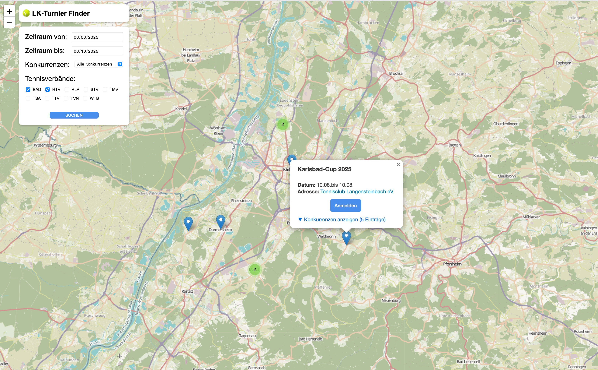

<h1 align="center" style="border-bottom: none;">🎾 Tennis Tournament Finder</h1>
<h3 align="center">A simple Map showing all recent tennis tournaments for passionate tennis players in Germany.</h3>

    
    

## Getting Started

[Try it out!](https://timoknapp.github.io/tennis-tournament-finder/)

## Features

* Currently supported tennis federations:
  * [Badischer Tennis Verband (BAD)](https://www.badischertennisverband.de/)
  * [Hessischer Tennis Verband (HTV)](https://www.htv-tennis.de/)
  * [Rheinland-Pfälzischer Tennis Verband (RPTV)](https://www.rlp-tennis.de/)
  * [Sächsischer Tennis Verband (STV)](https://www.stv-tennis.de)
  * [Tennisverband Mecklenburg-Vorpommern (TMV)](https://www.tennis-mv.de)
  * [Tennisverband Sachsen-Anhalt (TSA)](https://www.tennis-tsa.de)
  * [Thüringer Tennis-Verband (TTV)](https://www.ttv-tennis.de)
  * [Tennis-Verband Niederrhein (TVN)](https://www.tvn-tennis.de)
  * [Württembergischer Tennis Bund (WTB)](https://www.wtb-tennis.de/)
* Helps you finding the tournaments around you
* Short link to the official Tournament at [mybigpoint](https://spieler.tennis.de/web/guest/turniersuche) in order to sign up for the tournament
* Link to address on Google Maps.
* PWAs (Progressive Web Apps) support. You can install the app on your phone.

### Soon

* Support for more tennis federations:
  * [Bayerischer Tennis Verband (BTV)](https://www.btv.de)
  * [Tennis-Verband Berlin-Brandenburg (TVBB)](https://www.tvbb.de)
  * [Hamburger Tennis-Verband](https://www.hamburger-tennisverband.de)
  * [Tennisverband Mittelrhein (TVM)](https://www.tvm-tennis.de)
  * [Tennisverband Niedersachsen-Bremen (TNB)](https://www.tnb-tennis.de)
  * [Saarländischer Tennisbund (STB)](https://www.stb-tennis.de)
  * [Tennisverband Schleswig-Holstein (TSH)](https://www.tennis.sh)
  * [Westfälischer Tennis-Verband (WTV)](https://www.wtv.de)

## FAQ

### 1. Tournament is not shown with the correct location on the map

This is a known issue. The location of the tournament is not always correct. This is due to the fact that [OSM](https://www.openstreetmap.de) is not always capable of performing the geocoding right. There are two potential outcomes:
  
  1. Tournament location falls back to the default address of the corresponding tennis federation. There will then be a list of tournaments associated to the default address.
     * 
  2. Tournament location is showing a completely different location. In this case please click on the link next to "Adresse". This will then lead you to the address on [Google Maps](http://maps.google.com) and this location is mostly correct.
